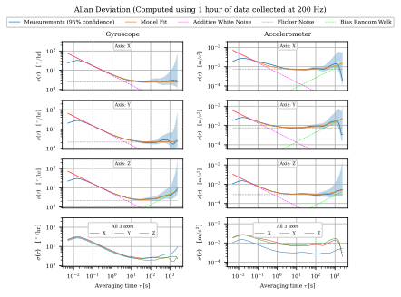
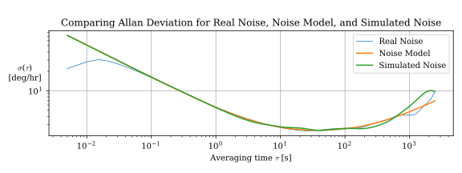

# Background on Measuring, Interpreting, and Applying IMU Noise Parameters
[See Appendix B of my Master's Thesis](https://publications.ri.cmu.edu/storage/publications/2026/05/ri_thesis_20260505225109.pdf#appendix.a.B)

# Why This Tool is Better Than Previous Ones:
1. Computes *Overlapping* Allan Variance (AVAR), as recommended by IEEE Standard 952. Most tools compute *Classical* AVAR
2. Shows 95% confidence intervals for Allan Deviation Measurements. In 4 years, I've never seen another tool do this.
3. Estimates the often-neglected flicker noise component. I've never seen another tool do this.
4. Fits the entire AVAR curve to infer 3 noise parameters. Most other tools fit separate lines for white noise and random walk. 
5. Runs in Python. No need to pay for MATLAB :-)
6. It's fast and RAM-friendly - Leverages numpy vectorization, multiprocessing, and shared memory between processes
7. It's fast (part 2): Computes AVAR at just enough logarithmically-spaced averaging times, not thousands of linearly-spaced times.

# Setup (Linux)
1. Clone this repo locally
2. Run the following commands in the repo root to setup a virtual environment:
    1. `python3 -m venv .venv`
    2. `source .venv/bin/activate`
    3. `pip3 install matplotlib numpy pandas scipy tqdm`
3. Download and extract [the example IMU data](https://drive.google.com/drive/folders/1qvu6OItxqq2kEY2xy-pCIMD6w1s4zgjc?usp=sharing) and save it to a folder named `example_IMU_data` in this repo's root

# Demo: Inferring Noise Parameters
1. Launch the virtual environment: `source .venv/bin/activate`
2. Run `python3 computeIMUNoiseParams.py --csv example_IMU_data/EpsonG364/1hr.csv`
3. See results:

    **Noise parameters**: `example_IMU_data/EpsonG364/Allan_Variance_Analysis_Results_1hr/output.txt`

    **Plot**: `example_IMU_data/EpsonG364/Allan_Variance_Analysis_Results_1hr/Allan_dev_model_fit.pdf`. It should look like: 
    

# Demo: Simulating IMU Noise Using Inferred Parameters
1. Ensure `python3 computeIMUNoiseParams.py --csv example_IMU_data/EpsonG364/1hr.csv` was already run
2. Run `python3 simulate_IMU_noise.py`. It should produce a plot `real_vs_model_vs_sim.pdf` that looks like: 
    
 
# Notes
1.  This tool assumes the gyroscope and accelerometer data in the csv have units of [rad/s] and [m/s^2], respectively.
2. This tool assumes the input file's columns are named as such:
Time [s],Gyroscope x [rad/s],Gyroscope y [rad/s],Gyroscope z [rad/s],Accelerometer x [m/s^2],Accelerometer y [m/s^2],Accelerometer z [m/s^2]
3. Power Spectral Densities in `output.txt` are **two-sided**

# Citation
If you use this software, please cite both of the following:

```bibtex
@misc{tushaarjainCarnegieMellonIMU2026,
  title = {Carnegie {{Mellon IMU Allan Variance Analysis Tool}}},
  author = {{Tushaar Jain}},
  year = 2026,
  address = {Robotics Institute, Planetary Robotics Lab (PRL) and Robot Perception Lab (RPL)},
  url = {https://github.com/2shaar/Carnegie-Mellon-IMU-Allan-Variance-Analysis-Tool},
  howpublished = {Carnegie Mellon University},
}
@mastersthesis{jainDesignImplementationValidation2026,
  title = {Design, {{Implementation}}, and {{Validation}} of a {{State Estimator}} for the {{MoonRanger Lunar Rover}}},
  author = {Jain, Tushaar},
  year = 2026,
  month = may,
  number = {CMU-RI-TR-26-31},
  address = {Pittsburgh, PA},
  url = {https://publications.ri.cmu.edu/design-implementation-and-validation-of-a-state-estimator-for-the-moonranger-lunar-rover},
  school = {Carnegie Mellon University},
}
```
